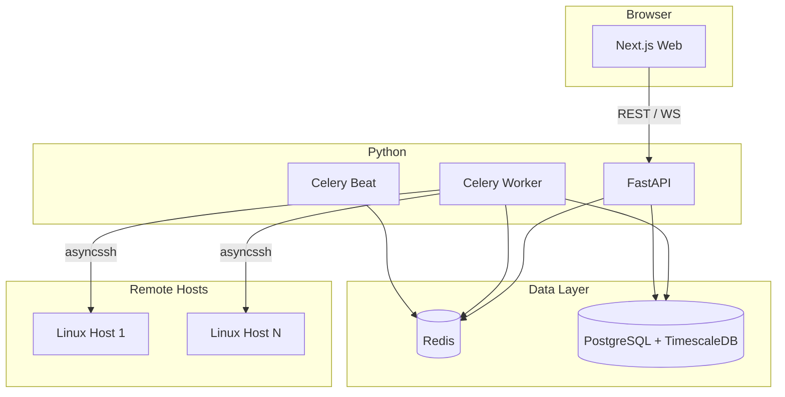

# Plan — SSH 원격 프로세스 모니터링 (옵션 A)

> **전제:** `research.md` 승인  
> **상태:** 초안 · **다음 단계:** 본 문서 검토·승인 후 `implement.md` 기준으로 구현 착수

---

## 1. 범위

### 1.1 MVP (Phase 1) — 포함

- 호스트 등록·SSH 연결 테스트·암호화 저장
- Celery Beat + Worker: 60초(설정 가능) 주기 폴링
- asyncssh 수집, system/user 분류
- PostgreSQL + TimescaleDB 저장, 일·시간 rollup
- FastAPI REST + WebSocket
- Next.js: 대시보드, heatmap 캘린더, 호스트 관리, 검색
- Docker Compose + GitHub Actions (pytest, ruff)

### 1.2 Phase 2 — 이후

- Timescale continuous aggregates, retention 정책 UI
- 알림(Slack/Email), Flower 모니터링
- Push 에이전트, RBAC/OAuth2
- 스냅샷 S3 아카이브

---

## 2. 시스템 아키텍처



---

## 3. 구현 단계

### Phase 1-A — 저장소·인프라

| # | 작업 | 산출물 |
|---|------|--------|
| 1 | `backend/` FastAPI 프로젝트 (poetry 또는 uv) | `pyproject.toml` |
| 2 | `web/` Next.js App Router | `web/` |
| 3 | Docker Compose: timescaledb, redis, api, worker, beat, web | `docker-compose.yml` |
| 4 | Alembic 초기 마이그레이션 + Timescale extension | `alembic/versions/` |
| 5 | `.env.example`, README | 문서 |

### Phase 1-B — 백엔드 코어

| # | 작업 | 산출물 |
|---|------|--------|
| 6 | `core/config.py`, DB session, 의존성 주입 | `app/core/` |
| 7 | SQLAlchemy models: Host, Snapshot, Process, Session, Rollup | `app/models/` |
| 8 | `SshService` — asyncssh 연결·명령·known_hosts | `app/services/ssh.py` |
| 9 | `ParserService` — ps/who 파서 + pytest | `app/services/parser.py` |
| 10 | `ClassificationService` — 규칙 엔진 + 시드 | `app/services/classifier.py` |
| 11 | `CollectorService` — 수집·저장 트랜잭션 | `app/services/collector.py` |

### Phase 1-C — Celery·집계

| # | 작업 | 산출물 |
|---|------|--------|
| 12 | `celery_app.py`, `tasks.poll_host` | `worker/` |
| 13 | Host CRUD 시 Beat 스케줄 동기화 (DB + dynamic beat) | 스케줄러 |
| 14 | `tasks.build_daily_rollup` | rollup 테이블 |
| 15 | hypertable 생성 마이그레이션 | Timescale |

### Phase 1-D — API·실시간

| # | 작업 | 산출물 |
|---|------|--------|
| 16 | `routers/hosts.py` — CRUD, test-connection | REST |
| 17 | `routers/activity.py` — calendar, day-summary | REST |
| 18 | `routers/search.py` — 기간·사용자·cmd 검색 | REST |
| 19 | `routers/ws.py` — 스냅샷 브로드캐스트 | WebSocket |
| 20 | JWT 인증 (관리 API 최소) | `app/core/security.py` |

### Phase 1-E — 프론트엔드

| # | 작업 | 산출물 |
|---|------|--------|
| 21 | API 클라이언트, 레이아웃 | `web/` |
| 22 | 대시보드 — 라이브 테이블 (WS) | `/` |
| 23 | 활동 캘린더 — heatmap + hover | `/activity` |
| 24 | 24h Recharts drill-down | `/activity/[date]` |
| 25 | 호스트·검색 페이지 | `/hosts`, `/search` |

### Phase 1-F — 배포·품질

| # | 작업 | 산출물 |
|---|------|--------|
| 26 | GitHub Actions: ruff, pytest, docker | `ci.yml` |
| 27 | E2E 스모크 (선택) | Playwright |
| 28 | 운영 가이드 | README |

---

## 4. SQLAlchemy 모델 개요

```python
class Host(Base):
    __tablename__ = "hosts"
    id: Mapped[str]  # uuid
    name: Mapped[str]
    hostname: Mapped[str]
    port: Mapped[int] = 22
    ssh_user: Mapped[str]
    encrypted_key: Mapped[str]
    poll_interval_sec: Mapped[int] = 60
    enabled: Mapped[bool] = True

class ProcessSnapshot(Base):
    __tablename__ = "process_snapshots"
    id: Mapped[str]
    host_id: Mapped[str]
    collected_at: Mapped[datetime]  # hypertable time column
    parser_version: Mapped[str]

class ProcessRecord(Base):
    classification: Mapped[str]  # system | user | unknown
    pid, ppid, user, comm, cmd, cpu_percent, ...

class DailyActivityRollup(Base):
    host_id, user, date, hour  # hour: 0-23 or -1 for daily
    event_count, summary_json
```

Alembic 마이그레이션에서:

```sql
SELECT create_hypertable('process_snapshots', 'collected_at', if_not_exists => TRUE);
```

---

## 5. REST API 계약 (MVP)

| Method | Path | 설명 |
|--------|------|------|
| GET | `/api/v1/health` | 헬스체크 |
| GET/POST/PATCH/DELETE | `/api/v1/hosts` | 호스트 관리 |
| POST | `/api/v1/hosts/{id}/test-connection` | SSH 테스트 |
| GET | `/api/v1/hosts/{id}/live` | 최신 스냅샷 |
| GET | `/api/v1/search/processes` | 쿼리 파라미터 필터 |
| GET | `/api/v1/activity/calendar` | granularity=day\|week\|month\|year |
| GET | `/api/v1/activity/day-summary` | tooltip용 |
| WS | `/ws/v1/live` | host 구독, snapshot 이벤트 |

---

## 6. UI 와이어

### 대시보드 `/`

- 호스트 선택, 사용자×프로세스 테이블, classification 뱃지
- WS 연결 상태, 마지막 수집 시각

### 활동 `/activity`

- 일|주|월|년 토글, 녹색 heatmap
- Hover: `day-summary` API 결과
- 클릭 → 24시간 차트

### 호스트 `/hosts`

- 등록·키 입력·연결 테스트·폴링 주기

---

## 7. 환경 변수

| 변수 | 설명 |
|------|------|
| `DATABASE_URL` | `postgresql+asyncpg://...` |
| `REDIS_URL` | Celery broker |
| `ENCRYPTION_KEY` | Fernet 키 (SSH private key) |
| `JWT_SECRET` | API 인증 |
| `SSH_MAX_CONCURRENT` | 기본 10 |
| `CORS_ORIGINS` | Next.js URL |

---

## 8. 테스트 전략

| 레벨 | 도구 |
|------|------|
| Unit | pytest — parser, classifier |
| API | httpx AsyncClient + TestClient |
| Integration | mock asyncssh |
| Fixture | Ubuntu/RHEL `ps`/`who` 샘플 |

---

## 9. Git·배포

- 브랜치: `cursor/*-574a`
- CI: PR 시 pytest + ruff + docker build
- 프로덕션: `docker compose pull && up -d`

---

## 10. 확인 체크리스트 (승인용)

- [ ] MVP 범위(§1.1) 동의
- [ ] FastAPI + Celery + TimescaleDB 구조 동의
- [ ] API 계약(§5) 동의
- [ ] 폴링 60초, JWT 최소 인증 동의

**승인 후:** `implement.md` §1부터 구현.

**승인자:** _______________  
**승인일:** _______________
