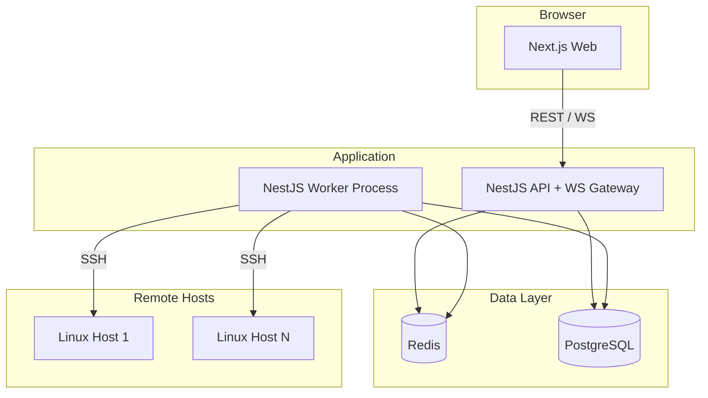

# Plan — SSH 원격 프로세스 모니터링 (옵션 B)

> **전제:** `research.md` 승인  
> **상태:** 초안 · **다음 단계:** 본 문서 검토·승인 후 `implement.md` 기준으로 구현 착수

---

## 1. 범위

### 1.1 MVP (Phase 1) — 포함

- 호스트 등록·SSH 연결 테스트·암호화 저장
- 60초(설정 가능) 주기 BullMQ 폴링
- 프로세스·세션 수집 및 system/user 분류
- PostgreSQL 저장 + 일·시간 rollup
- REST: 호스트, 스냅샷 검색, 캘린더·일별 요약
- WebSocket: 최신 스냅샷 브로드캐스트
- Next.js: 대시보드, 캘린더 heatmap, 호스트 관리, 기간 검색
- Docker Compose 로컬 실행 + GitHub Actions 빌드

### 1.2 Phase 2 — 이후

- 알림(Slack/Email), dead-letter UI
- Push 에이전트, multi-tenant
- 스냅샷 아카이브(S3), Grafana 연동
- NextAuth / RBAC 세분화

---

## 2. 시스템 아키텍처



---

## 3. 구현 단계

### Phase 1-A — 저장소·인프라 (기반)

| # | 작업 | 산출물 |
|---|------|--------|
| 1 | npm workspaces 모노레포 초기화 | `package.json`, `apps/*`, `packages/shared` |
| 2 | Docker Compose: postgres, redis, api, worker, web | `docker-compose.yml` |
| 3 | Prisma 스키마·마이그레이션 | `prisma/schema.prisma` |
| 4 | `.env.example`, README 실행 방법 | 문서 |

### Phase 1-B — 백엔드 코어

| # | 작업 | 산출물 |
|---|------|--------|
| 5 | NestJS `api` — Config, Prisma, Health | `apps/api` |
| 6 | `HostModule` — CRUD, 연결 테스트 | REST |
| 7 | `SshModule` — ssh2 연결 풀, 명령 실행 | 서비스 |
| 8 | `ParserModule` — ps/who 파서 + 단위 테스트 | `packages/shared` 또는 api |
| 9 | `ClassificationModule` — 규칙 엔진 | 서비스 + 시드 규칙 |
| 10 | `CollectorModule` — 스냅샷 저장 | `ProcessSnapshot` |

### Phase 1-C — 워커·집계

| # | 작업 | 산출물 |
|---|------|--------|
| 11 | BullMQ `host-poll` queue·processor | `apps/worker` |
| 12 | 호스트 등록 시 repeatable job 등록/갱신 | 스케줄러 |
| 13 | `BuildDailyRollupJob` — 시간대별 집계 | `DailyActivityRollup` |
| 14 | 실패 재시도·로깅 | BullMQ opts |

### Phase 1-D — API·실시간

| # | 작업 | 산출물 |
|---|------|--------|
| 15 | `ActivityModule` — calendar, day-summary | REST |
| 16 | `SearchModule` — user, cmd, date range | REST |
| 17 | `EventsGateway` — snapshot:update | Socket.io |
| 18 | JWT 가드 (관리 API) | AuthModule (최소) |

### Phase 1-E — 프론트엔드

| # | 작업 | 산출물 |
|---|------|--------|
| 19 | 레이아웃·네비·API 클라이언트 | `apps/web` |
| 20 | 대시보드 — 호스트·라이브 테이블 (WS) | 페이지 |
| 21 | 활동 캘린더 — heatmap + hover tooltip | 페이지 |
| 22 | 시간대 drill-down (Recharts 24h) | 컴포넌트 |
| 23 | 호스트 관리·검색 UI | 페이지 |

### Phase 1-F — 배포·품질

| # | 작업 | 산출물 |
|---|------|--------|
| 24 | GitHub Actions: lint, test, docker build | `.github/workflows/ci.yml` |
| 25 | E2E 스모크 (선택: Playwright 로그인·캘린더) | `e2e/` |
| 26 | README·운영 가이드 | 문서 |

---

## 4. Prisma 스키마 개요

```prisma
model Host {
  id                String   @id @default(cuid())
  name              String
  hostname          String
  port              Int      @default(22)
  sshUser           String
  encryptedKey      String   // AES-GCM
  pollIntervalSec   Int      @default(60)
  enabled           Boolean  @default(true)
  snapshots         ProcessSnapshot[]
  rollups           DailyActivityRollup[]
  createdAt         DateTime @default(now())
  updatedAt         DateTime @updatedAt
}

model ProcessSnapshot {
  id            String   @id @default(cuid())
  hostId        String
  host          Host     @relation(fields: [hostId], references: [id])
  collectedAt   DateTime
  parserVersion String
  sessions      UserSession[]
  processes     ProcessRecord[]
  @@index([hostId, collectedAt(sort: Desc)])
}

model ProcessRecord {
  id             String   @id @default(cuid())
  snapshotId     String
  snapshot       ProcessSnapshot @relation(...)
  pid            Int
  ppid           Int
  user           String
  comm           String
  cmd            String
  cpuPercent     Float?
  memPercent     Float?
  classification ProcessClass // SYSTEM | USER | UNKNOWN
}

model DailyActivityRollup {
  id           String   @id @default(cuid())
  hostId       String
  user         String
  date         DateTime @db.Date
  hour         Int      // 0-23, or -1 for daily total
  eventCount   Int
  summaryJson  Json     // top processes for tooltip
  @@unique([hostId, user, date, hour])
}
```

(전체 필드는 구현 시 `schema.prisma`에 반영)

---

## 5. REST API 계약 (MVP)

| Method | Path | 설명 |
|--------|------|------|
| GET | `/api/v1/health` | 헬스체크 |
| GET/POST/PATCH/DELETE | `/api/v1/hosts` | 호스트 관리 |
| POST | `/api/v1/hosts/:id/test-connection` | SSH 테스트 |
| GET | `/api/v1/hosts/:id/live` | 최신 스냅샷 |
| GET | `/api/v1/search/processes` | `?user=&q=&from=&to=&hostId=` |
| GET | `/api/v1/activity/calendar` | `?from=&to=&granularity=` |
| GET | `/api/v1/activity/day-summary` | `?date=&hostId=` |
| WS | `/events` | `subscribe:host`, `snapshot:update` |

---

## 6. UI 와이어 (텍스트)

### 대시보드 `/`

- 상단: 호스트 선택 드롭다운
- 본문: 사용자 × 프로세스 테이블 (classification 뱃지)
- 우측: 마지막 수집 시각, WS 연결 상태

### 활동 `/activity`

- 토글: 일 | 주 | 월 | 년
- Heatmap 그리드 (녹색 강도 = 활동량)
- Hover: `"user1: bash 1.5h, node 0.8h | user2: ..."`
- 클릭: 해당일 24시간 차트 + 상세 테이블

### 호스트 `/hosts`

- 목록 + 추가 모달 (키 paste, interval)
- 연결 테스트 버튼

---

## 7. 환경 변수

| 변수 | 설명 |
|------|------|
| `DATABASE_URL` | PostgreSQL |
| `REDIS_URL` | BullMQ |
| `ENCRYPTION_KEY` | 32-byte hex — SSH 키 암호화 |
| `JWT_SECRET` | API 인증 |
| `SSH_CONCURRENCY` | 기본 10 |
| `CORS_ORIGIN` | Next.js URL |

---

## 8. 테스트 전략

| 레벨 | 대상 |
|------|------|
| Unit | ps/who 파서, 분류 규칙 |
| Integration | HostService + mock SSH |
| E2E (선택) | 캘린더 API + UI 스모크 |

Fixture: Ubuntu 22.04 `ps`/`who` 샘플 출력 파일.

---

## 9. Git·배포 흐름

1. `main` — 안정
2. `cursor/*-574a` — 기능 브랜치
3. PR → CI (lint, test, docker build)
4. 태그 `v0.x` → 서버에서 `docker compose pull && up -d`

---

## 10. 확인 체크리스트 (승인용)

- [ ] MVP 범위(§1.1) 동의
- [ ] 6단계 구현 순서(§3) 동의
- [ ] API 계약(§5) 동의
- [ ] 기본 폴링 **60초**, JWT 최소 인증 동의
- [ ] Phase 2 항목은 이후 이슈로 분리 동의

**승인 후:** `implement.md`의 체크리스트대로 구현 시작.

**승인자:** _______________  
**승인일:** _______________
